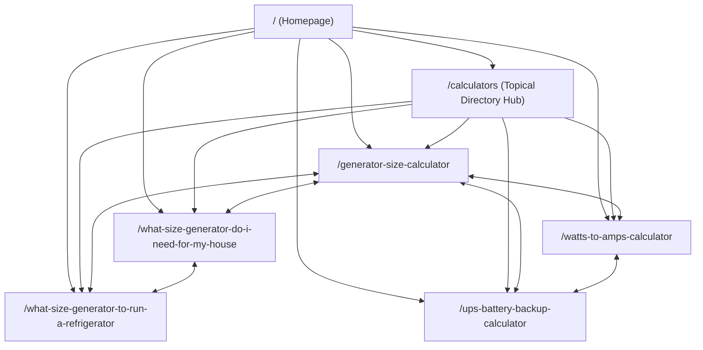

# CalcMyPower.com — Scalable SEO Information Architecture (`SEO_ARCHITECTURE.md`)

**Document Owner:** Lead SEO Foundation Specialist  
**Status:** Production Standard  
**Applies To:** All current and future calculators, guides, category hubs, URLs, and navigation components on CalcMyPower.com.

---

## 1. Architectural Philosophy: Intent-First, Flat Slugs + Topical Cluster Hubs

A common SEO mistake on tool websites is creating deep, rigid directory trees (`/calculators/generators/portable/generator-size-calculator`) or spinning up 8 empty category pages (`/solar/`, `/ev/`, `/home-energy/`) before calculators exist to populate them.

### Why CalcMyPower Uses Root-Level Descriptive Slugs (`/[slug]`) + Clustered Hubs

1. **Zero Redirect Debt & Preservation of Live Equity:** CalcMyPower already has 5 live content routes at the root level (`/generator-size-calculator`, `/ups-battery-backup-calculator`, `/watts-to-amps-calculator`, `/what-size-generator-do-i-need-for-my-house`, `/what-size-generator-to-run-a-refrigerator`). Keeping all calculators and guides at root-level slugs (`/[slug]`) preserves 100% of existing URLs, tests, and deep links without redirect chains.
2. **Cross-Cluster Tool Flexibility:** Electrical and energy calculators naturally bridge multiple categories. For example:
   - `/watts-to-amps-calculator` is essential to **Electricity**, **Solar**, **Batteries**, and **Generators**.
   - `/ups-battery-backup-calculator` serves both **UPS** and **Battery Storage** intents.
   - Placing tools at root slugs (`/watts-to-amps-calculator`, `/wire-size-calculator`, `/solar-panel-calculator`) prevents trapping a cross-cutting tool inside a single siloed URL path and eliminates word repetition in URLs (avoiding `/generator/generator-size-calculator`).
3. **How Google Understands Topical Hierarchy:** Per Google Search Central documentation, Google determines site hierarchy and topical clustering primarily from **internal linking topology, hub-and-spoke navigation, `BreadcrumbList` structured data, and anchor text context**, not merely URL slash count.
4. **Zero Thin Category Pages (Gated Hub Rule):** To strictly comply with Google's Scaled Content Abuse and Helpful Content policies, CalcMyPower **never publishes empty or 1-tool category pages**. All topical clusters are organized inside the central `/calculators` directory hub (with deep-linkable cluster anchors such as `/calculators#generators`, `/calculators#electricity`, `/calculators#ups-battery`), and a standalone category landing page is only created when a cluster reaches **at least 3 live calculators and 2 supporting guides**.

---

## 2. The 7 Core Topical Clusters of CalcMyPower

Every calculator and editorial guide on CalcMyPower must belong to one primary topical cluster (and may declare secondary related clusters in `src/lib/seo/registry.ts`):

| Cluster ID | Cluster Name | Anchor on `/calculators` | Primary User & Search Intent | Core Commercial / Affiliate Alignment |
|---|---|---|---|---|
| `generators` | **Generators & Outage Backup** | `/calculators#generators` | Sizing portable, inverter, and standby generators; running vs. starting watts; fuel consumption; transfer switch planning. | Portable inverter generators, dual-fuel generators, manual transfer switches, 30A/50A L14-30P cords, soft starters. |
| `ups-battery` | **UPS & Battery Storage** | `/calculators#ups-battery` | Estimating UPS runtime hours, sizing 12V/24V/48V LiFePO4 and AGM battery banks, Ah-to-Wh conversion, inverter sizing, charge times. | LiFePO4 deep-cycle batteries, pure sine wave inverters, desktop/server UPS units, smart battery chargers, battery monitors. |
| `electricity` | **Electricity & Circuit Sizing** | `/calculators#electricity` | Converting Watts, Amps, Volts, and VA across DC, 1Φ AC, and 3Φ AC; wire gauge (AWG) and voltage drop; breaker sizing reference. | Digital AC/DC clamp meters, circuit breaker finders, AWG copper wire, voltage testers, subpanels. |
| `solar` | **Solar PV & Off-Grid** | `/calculators#solar` | Sizing solar panel arrays, MPPT charge controllers, off-grid solar + battery autonomy, peak sun hours, solar payback. | MPPT solar charge controllers, 100W–400W monocrystalline panels, solar generator power stations, MC4 wiring kits. |
| `ev-charging` | **EV Charging** | `/calculators#ev-charging` | Level 1 vs. Level 2 home charging time, 240V circuit and breaker sizing (80% continuous rule), EV charging cost vs. gas. | Level 2 J1772 / NACS 240V EV chargers, NEMA 14-50 heavy-duty receptacles, smart home energy monitors. |
| `home-energy` | **Home Energy & Electricity Cost** | `/calculators#home-energy` | Appliance kWh usage, monthly/annual utility bill cost at U.S. ¢/kWh rates, HVAC/water heater energy consumption. | Plug-in Kill-A-Watt energy monitors, smart thermostats, whole-home panel energy monitors. |
| `rv-power` | **RV & Mobile Power** | `/calculators#rv-power` | 30A vs. 50A RV service load budgeting, 12V/24V house battery boondocking budgets, RV rooftop AC generator sizing. | 30A/50A RV EMS surge protectors, RV inverter chargers, compressor soft starters, portable folding solar panels. |

---

## 3. URL Naming Standards & Canonical Rules

### 3.1 Calculator URLs
- **Format:** `/[primary-concept]-calculator` (or `/[primary-concept]-[secondary-qualifier]-calculator` only when necessary for clarity).
- **Rules:**
  - All lowercase, ASCII alphanumeric characters and single hyphens (`-`).
  - No trailing slashes (`https://calcmypower.com/generator-size-calculator`).
  - Never include dates, version numbers, stop words (`the`, `a`, `for`, `my`), or filler words (`free`, `best`, `online`, `tool`) in calculator URLs.
  - **Examples:**
    - `/generator-size-calculator` (Live)
    - `/ups-battery-backup-calculator` (Live)
    - `/watts-to-amps-calculator` (Live)
    - `/wire-size-calculator` (Planned — covers AWG & voltage drop)
    - `/amp-hours-to-watt-hours-calculator` (Planned)
    - `/electricity-cost-calculator` (Planned)
    - `/solar-panel-calculator` (Planned)
    - `/ev-charging-time-calculator` (Planned)

### 3.2 Editorial Guide URLs
- **Format:** `/[natural-search-intent-slug]`
- **Rules:**
  - Match the primary natural-language problem query without unnecessary fluff or dates.
  - Never create multiple guide URLs for minor phrasing variations (e.g., never create both `/what-size-generator-to-run-a-refrigerator` and `/how-many-watts-generator-for-fridge`).
  - **Examples:**
    - `/what-size-generator-do-i-need-for-my-house` (Live)
    - `/what-size-generator-to-run-a-refrigerator` (Live)

### 3.3 Query Parameters & Deep-Linked Scenarios
- Calculators may support URL query parameters to pre-populate educational scenarios from articles (e.g., `/generator-size-calculator?scenario=winter-essentials` or `/generator-size-calculator?scenario=refrigerator-outage`).
- **Mandatory Canonical Rule:** Every calculator page must declare its clean base URL (`https://calcmypower.com/generator-size-calculator`) as `alternates.canonical` in `metadata` so Google consolidates all `?scenario=...` links into the primary calculator landing page and never indexes duplicate parameter URLs.
- **Mandatory SSR Rule:** Reading `useSearchParams()` must NEVER wrap the entire calculator page in `<Suspense fallback={null}>`. Parameter reading must be isolated to a non-blocking client effect or tiny leaf Suspense component so the full default calculator HTML renders statically at build time.

---

## 4. Site Hierarchy & Crawl Depth Guarantee

Every indexable page on CalcMyPower must satisfy a **Maximum Crawl Depth of 2 Clicks** from the Homepage (`/`):

### Structural Guarantees
1. **Global Header (`src/components/layout/Header.tsx`):** Links directly to `/` (Brand), top flagship calculators, and `/calculators` ("All Calculators").
2. **Global Footer (`src/components/layout/Footer.tsx`):** Links to all live calculators, featured sizing guides, and `/calculators`.
3. **Visible Breadcrumbs:**
   - Calculators: `Home` (`/`) → `Calculators` (`/calculators`) → `[Calculator Name]`
   - Guides: `Home` (`/`) → `[Parent Calculator Name]` (`/[calculator-slug]`) → `[Guide Title]`
4. **Central Registry (`src/lib/seo/registry.ts`):** All calculators, guides, clusters, sitemaps, and automated SEO tests read from one centralized TypeScript registry so no page can ever be added as an orphan.
